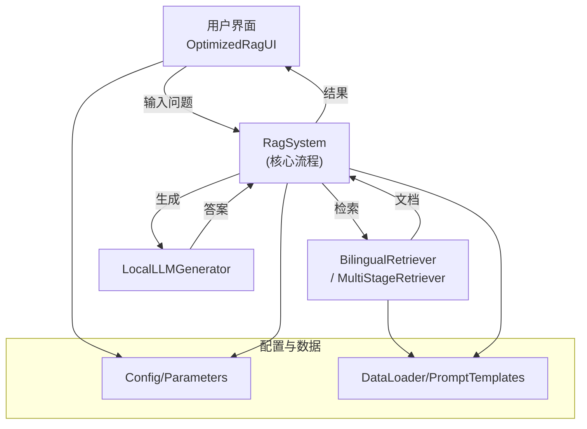

# 核心RAG系统文件逻辑说明 Core RAG System File Logic

---

## 1. 主入口与UI / Main Entry & UI

- **run_optimized_ui.py**
  - 中文：系统主入口，负责环境检测、配置加载、UI实例化与启动，通过 OptimizedRagUI 实现所有RAG能力的统一入口。
  - English: Main entry point, handles environment check, config loading, UI instantiation and launch. Uses OptimizedRagUI as the unified entry for all RAG capabilities.

- **xlm/ui/optimized_rag_ui.py**
  - 中文：主UI逻辑，接收用户输入，自动分流中英文问题，调用RAG主流程，展示检索、生成、重排序等结果。
  - English: Main UI logic, handles user input, routes Chinese/English queries, calls RAG workflow, displays retrieval, generation, reranking results.

- **xlm/ui/optimized_rag_ui_with_multi_stage.py**
  - 中文：扩展UI，集成多阶段检索系统，适用于AlphaFin等复杂金融场景。
  - English: Extended UI integrating multi-stage retrieval, for complex scenarios like AlphaFin.

---

## 2. 检索与生成核心 / Retrieval & Generation Core

- **xlm/components/rag_system/rag_system.py**
  - 中文：RAG主流程实现，负责检索、生成、Prompt组装、语言检测等，支持多语言和多种后端。
  - English: RAG main workflow, handles retrieval, generation, prompt assembly, language detection, supports multi-language and multiple backends.

- **xlm/components/retriever/bilingual_retriever.py**
  - 中文：双语检索器，支持中英文文档的向量化、FAISS检索、重排序等。
  - English: Bilingual retriever, supports vectorization, FAISS retrieval, reranking for Chinese and English docs.

- **alphafin_data_process/multi_stage_retrieval_final.py**
  - 中文：AlphaFin多阶段检索系统，支持分阶段检索、重排序、复杂特征处理。
  - English: AlphaFin multi-stage retrieval, supports staged retrieval, reranking, complex feature processing.

- **xlm/components/generator/local_llm_generator.py**
  - 中文：本地大模型生成器，负责加载本地LLM并生成答案。
  - English: Local LLM generator, loads local LLMs and generates answers.

---

## 3. 配置与数据 / Config & Data

- **config/parameters.py**
  - 中文：全局配置文件，包含模型路径、检索参数、缓存、UI参数等。
  - English: Global config file, includes model paths, retrieval params, cache, UI params, etc.

- **xlm/utils/unified_data_loader.py**
  - 中文：统一数据加载器，支持多格式数据的加载与预处理。
  - English: Unified data loader, supports multi-format data loading and preprocessing.

- **xlm/utils/dual_language_loader.py**
  - 中文：双语数据加载器，支持中英文数据的分离与加载。
  - English: Dual-language data loader, supports separation and loading of Chinese/English data.

- **xlm/dto/dto.py**
  - 中文：数据结构定义，标准化文档、元数据、RAG输出等。
  - English: Data structure definitions, standardizes docs, metadata, RAG output, etc.

---

## 4. Prompt与模板 / Prompt & Templates

- **xlm/components/prompt_templates/template_loader.py**
  - 中文：Prompt模板加载与管理，支持多种模板格式。
  - English: Prompt template loader/manager, supports multiple template formats.

- **data/prompt_templates/**
  - 中文：存放所有Prompt模板文件。
  - English: Stores all prompt template files.

---

## 5. 系统流程图 / System Flowchart

---

## 6. 主要模块调用关系 / Main Module Call Graph

- run_optimized_ui.py
  - 调用 OptimizedRagUI（UI主控）
    - 调用 RagSystem（核心RAG流程）
      - 调用 BilingualRetriever 或 MultiStageRetriever（检索/重排序）
      - 调用 LocalLLMGenerator（答案生成）
      - 调用 PromptTemplateLoader（Prompt组装）
    - 依赖 Config/Parameters、数据加载器、Prompt模板

---

## 7. 主要配置参数说明 / Main Config Parameters

| 参数名 / Param         | 说明（中文）                                   | Description (English)                                 |
|-----------------------|-----------------------------------------------|------------------------------------------------------|
| encoder.chinese_model_path | 中文编码器模型路径                        | Path to Chinese encoder model                         |
| encoder.english_model_path | 英文编码器模型路径                        | Path to English encoder model                         |
| encoder.device        | 编码器设备（如cuda:0）                        | Encoder device (e.g., cuda:0)                        |
| encoder.batch_size    | 编码器批处理大小                              | Encoder batch size                                   |
| retriever.use_faiss   | 是否启用FAISS检索                             | Whether to use FAISS retrieval                       |
| retriever.retrieval_top_k | FAISS检索返回top-k文档数                  | Top-k docs for FAISS retrieval                       |
| retriever.rerank_top_k    | 重排序后返回top-k文档数                   | Top-k docs after reranking                           |
| retriever.use_prefilter   | 是否使用元数据预过滤                       | Whether to use metadata prefilter                    |
| retriever.batch_size      | 检索器批处理大小                           | Retriever batch size                                 |
| reranker.model_name       | 重排序器模型名称                           | Reranker model name                                  |
| reranker.device           | 重排序器设备                               | Reranker device                                      |
| reranker.use_quantization | 是否量化重排序器                           | Whether to quantize reranker                         |
| reranker.quantization_type| 量化类型（4bit/8bit）                      | Quantization type (4bit/8bit)                        |
| generator.model_name      | 生成器模型名称                             | Generator model name                                 |
| generator.device          | 生成器设备                                 | Generator device                                     |
| generator.use_quantization| 是否量化生成器                             | Whether to quantize generator                        |
| generator.quantization_type| 量化类型                                  | Quantization type                                    |
| cache_dir                 | 缓存目录                                   | Cache directory                                      |
| data_dir                  | 数据目录                                   | Data directory                                       |
| max_samples               | 最大样本数                                 | Maximum number of samples                            |
| window_title/title        | UI窗口标题                                 | UI window title                                      |

---

如需更详细的开发文档、API说明或二次开发支持，请联系开发团队。